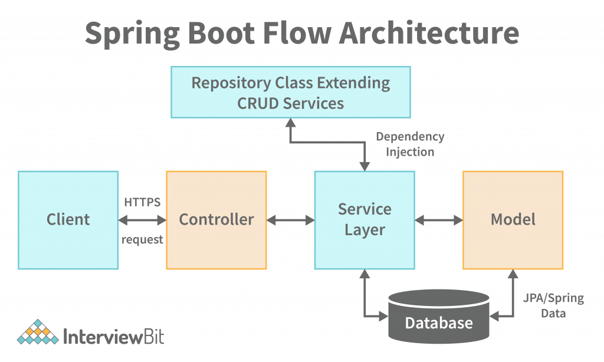

# CV_3_Example_Book

# Introduction to Spring Boot:

Spring Boot is a powerful and innovative framework built on top of the Spring framework that aims to simplify the process of building robust, production-ready Java applications. It provides a streamlined development experience by offering out-of-the-box solutions for common tasks, reducing boilerplate code, and promoting convention over configuration.

At its core, Spring Boot is designed to address the complexities associated with setting up and configuring Spring-based applications. Traditionally, developing Spring applications required manual configuration of various components such as application context, dependency injection, and web servers, among others. Spring Boot, however, eliminates much of this manual configuration by leveraging sensible defaults and auto-configuration.



Key Features of Spring Boot:

1. **Auto-Configuration**: Spring Boot automatically configures various components of the application based on the dependencies present in the classpath. This feature reduces the need for explicit configuration and allows developers to focus on writing application code rather than spending time on setup and configuration tasks.

2. **Starter Dependencies**: Spring Boot provides a collection of starter dependencies that encapsulate sets of libraries and configurations commonly used for specific tasks, such as web development, data access, security, and testing. Developers can include these starters in their projects to quickly bootstrap their applications with the required dependencies.

3. **Embedded Servers**: Spring Boot includes support for embedded servlet containers such as Tomcat, Jetty, and Undertow. This allows developers to package their applications as standalone JAR files that contain the necessary web server, making deployment and execution simpler and more consistent across different environments.

4. **Production-Ready Features**: Spring Boot includes a range of features aimed at facilitating the development of production-ready applications, such as health checks, metrics, auditing, and externalized configuration. These features enable developers to build applications that are robust, scalable, and easy to manage in a production environment.

5. **Actuator**: Spring Boot Actuator provides built-in endpoints for monitoring and managing the application at runtime. These endpoints expose information about application health, metrics, environment properties, and more, allowing developers to monitor and diagnose their applications effectively.

6. **Integration with Spring Ecosystem**: Spring Boot seamlessly integrates with other components of the Spring ecosystem, including Spring Framework, Spring Data, Spring Security, and Spring Cloud. This integration enables developers to leverage existing Spring knowledge and expertise while benefiting from the streamlined development experience offered by Spring Boot.

Overall, Spring Boot revolutionizes Java application development by simplifying the setup, configuration, and deployment processes, thereby accelerating the development cycle and empowering developers to focus on building high-quality, feature-rich applications. Its extensive features, robustness, and seamless integration with the Spring ecosystem make it a popular choice for developing modern Java applications.

# Infromation

Spring Boot is a Java application development framework that makes it easy and fast to create robust applications. The following concepts are the basic building blocks of the Spring Boot application architecture:

1. **Controller**: A controller is an application component that handles HTTP requests from clients. The controller receives the request, performs the requested actions, and then returns a response to the client. Each Controller defines a set of endpoints that determine how the application responds to different types of requests.

2. **Entity**: An entity is a class that represents a data object in a database. It usually corresponds to a single table in a relational database. Entities define the attributes and relationships of the data that are stored in the database. Within Spring Boot, the Java Persistence API (JPA) library is often used to map these entities to tables in the database.

3. **Repository**: Repository is a component that provides an abstract interface for communicating with the database. Repositories are used to store, read, update and delete data from the database. Spring Boot simplifies the implementation of Repositories by using the Spring Data JPA extension, which automatically generates an implementation based on defined interfaces and methods.

4. **Service**: A service is a component that contains the business logic of an application. Services implement functionalities that perform operations on data and provide them to Controllers. Services are often used to encapsulate application logic, improving modularity and code reusability. They are often used for operations that need more than one operation over data or that are higher level of abstraction than simple CRUD operations (create, read, update, delete).ad data or that are higher level of abstraction than simple CRUD operations (create, read, update, delete).


# Description of each of the technologies:

1. **Spring Web**: Spring Web provides basic support for building web applications using the Spring Framework. It includes various functionalities such as controllers, annotations for URL mapping, form processing solutions, session management, support for creating RESTful APIs, and more.

2. **Thymeleaf**: Thymeleaf is a templating system for creating dynamic web pages in Java. It is widely used in Spring framework for creating views in web applications. Thymeleaf allows you to write HTML pages with nested attributes that are automatically populated with data from the Spring model.

3. **Spring Data JPA**: Spring Data JPA is a part of the Spring framework that makes it easy to work with persistent data in Java using the Java Persistence API (JPA). It provides an abstraction over JPA and makes it easy to create repositories for manipulating data. Spring Data JPA also provides a number of features such as query methods, automatic query generation, and support for paging and sorting.

4. **MySQL Driver**: MySQL Driver is a library (or module) that allows communication with the MySQL database from Java. It provides a means for making database connections, executing queries, and manipulating data.

5. **Spring Boot Dev Tools**: Spring Boot Dev Tools are development tools that are part of the Spring Boot framework. These tools include various features that make web application development easier, such as automatically reloading changes (live reloading) when code is modified, automatically restarting the application when dependencies change, and more. They help speed up the development cycle and improve developer productivity.

# Annotations (`@RequestMapping`, `@PostMapping`, `@GetMapping`) 

1. **@RequestMapping**:
   - `@RequestMapping` was the original annotation for mapping HTTP requests to controller methods in the Spring Framework.
   - It can be used to map different HTTP method types (GET, POST, PUT, DELETE, etc.) and can have multiple values that define different paths.
   - It is generic and can be used for any type of HTTP request.
   - For example:
     ```java
     @RequestMapping(value = "/example", method = RequestMethod.GET)
     public String exampleMethod() {
         // Method code
     }
     ```

2. **@PostMapping**:
   - `@PostMapping` is a special case of `@RequestMapping` used to map HTTP POST requests to controller methods.
   - This annotation ensures that the controller method will only handle HTTP POST requests.
   - It is preferred for handling data that is typically sent using forms or other POST requests.
   - For example:
     ```java
     @PostMapping("/create")
     public String createNewObject() {
         // Code to create a new object
     }
      ```

     3. **@GetMapping**:
   - `@GetMapping` is another special case of `@RequestMapping` used to map HTTP GET requests to controller methods.
   - This annotation ensures that the controller method will only handle HTTP GET requests.
   - It is useful for retrieving data or displaying pages without modifying the data on the server.
   - For example:
     ```java
     @GetMapping("/show")
     public String showData() {
         // Code to display data
     }
     ```

Overall, `@PostMapping` and `@GetMapping` are specialized annotations that specify only one type of HTTP method (POST or GET), while `@RequestMapping` can be used for any type of HTTP method. Using specialized annotations can improve code readability and more clearly express the purpose of a given controller method.


# helpful links with more information

[Spring boot ](https://www.tutorialspoint.com/spring_boot/spring_boot_introduction.htm)

[Spring boot 2 ](https://www.javatpoint.com/spring-boot-tutorial)

[Spring boot video ](https://www.youtube.com/watch?v=Nv2DERaMx-4&t=12584s)

[Spring boot app 1 ](https://www.youtube.com/watch?v=HYGnVeCs0Yg)

[Spring boot app 2 ](https://www.youtube.com/watch?v=6zfIxgaVkQI)

[Spring boot app 3 ( with security) ](https://www.youtube.com/watch?v=4ga5bcBPgzo&list=PLvXZgw5HRzfgCcoV2KV2eIIemC6sl8Xla)

[Spring boot app 4 ( with react) ](https://www.youtube.com/watch?v=O_XL9oQ1_To)


